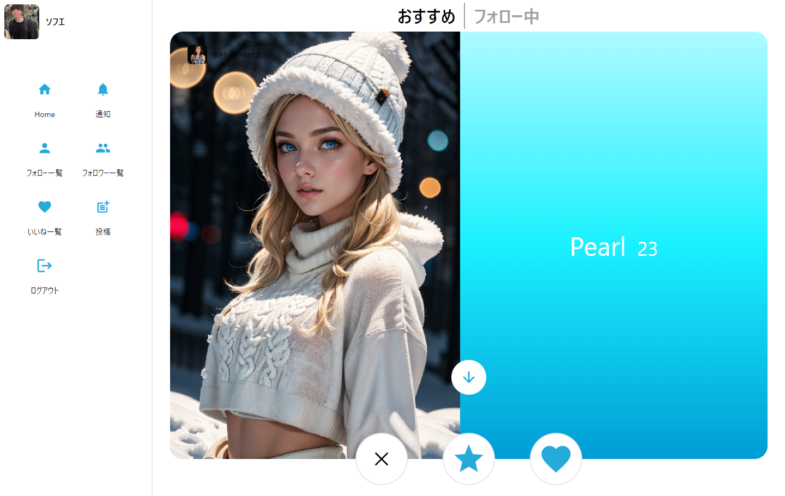
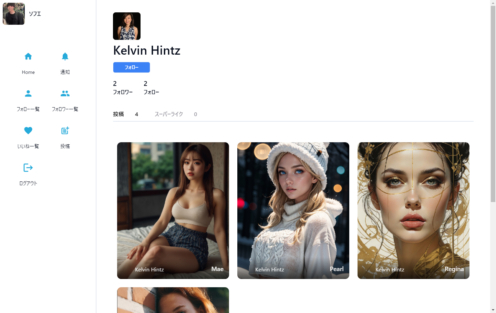
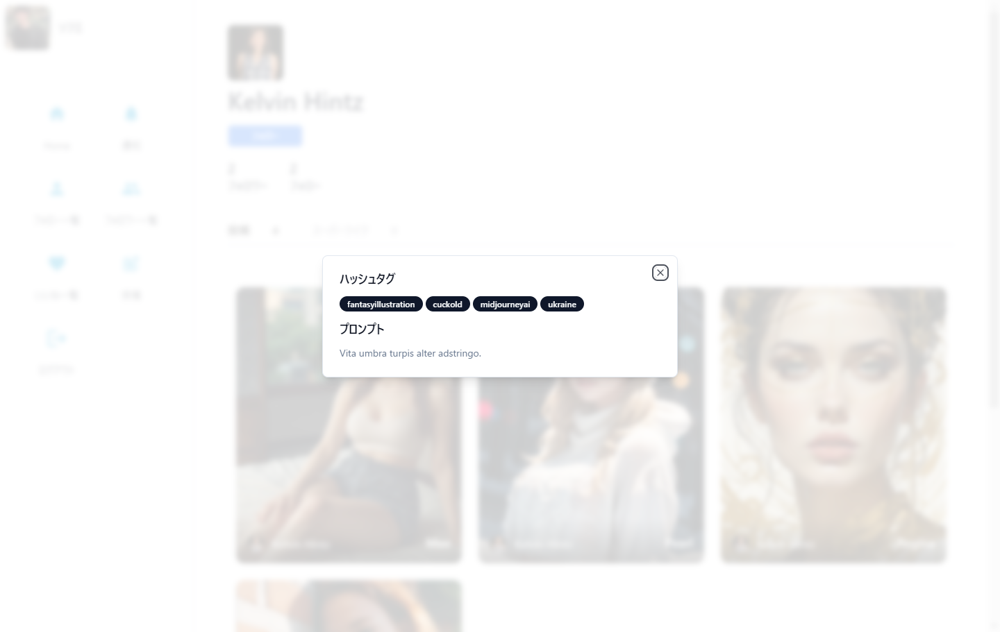
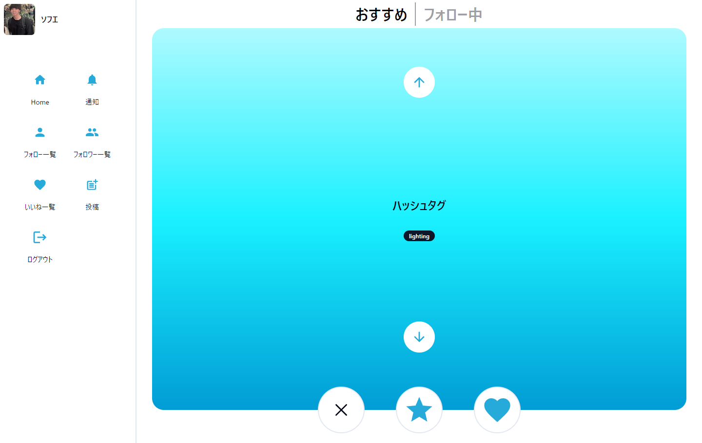
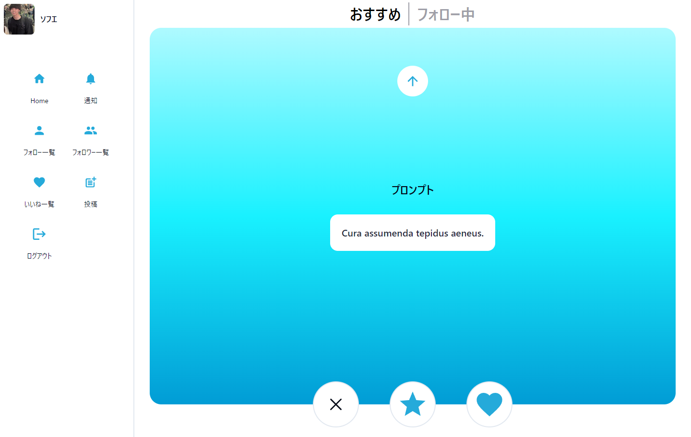
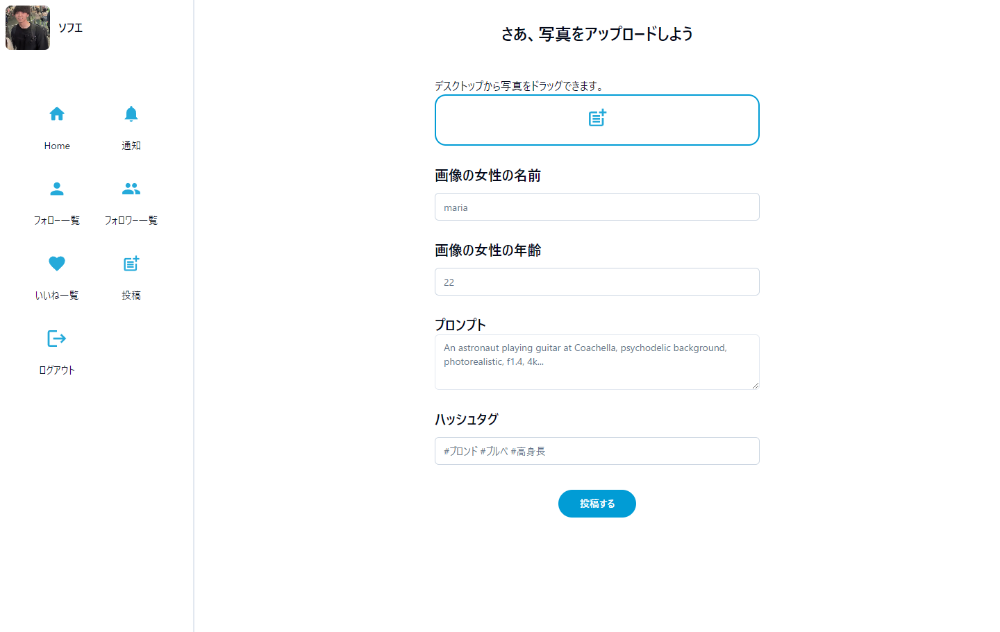
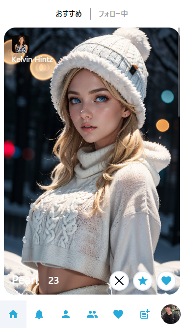
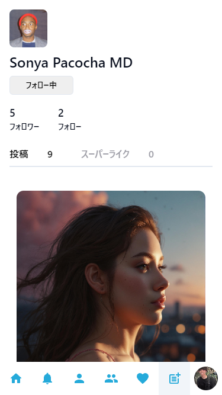
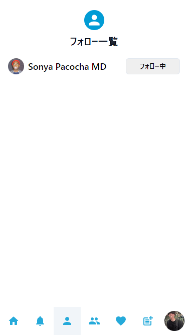

# BeauBelle

## 概要

BeauBelleは、AIが生成した女性の画像を共有し、いいね！やスーパーライク！、フォローなどを通じて他のユーザーと交流できるソーシャルメディアプラットフォームです。

## 機能

- **AI生成画像の投稿:** ユーザーは、Stable DiffusionなどのAIモデルを使用して生成した女性の画像を投稿できます。
- **プロンプトとハッシュタグの追加:** 投稿には、画像生成に使用したプロンプトと関連するハッシュタグを追加できます。
- **いいね！とスーパーライク！:** ユーザーは他のユーザーの投稿にいいね！やスーパーライク！をすることができます。スーパーライク！は特別ないいね！で、投稿者に通知されます。
- **フォロー:** ユーザーは他のユーザーをフォローして、そのユーザーの新しい投稿を自分のフィードで見ることができます。
- **おすすめフィード:** ユーザーの興味に基づいて、おすすめの投稿を表示します。
- **プロフィール:** ユーザーは自分のプロフィール画像、名前、フォロー/フォロワー数を表示できます。
- **通知:** いいね！、スーパーライク！、フォローに関する通知を受け取ることができます。
- **Google認証:** Googleアカウントを使用してログインできます。

## スクリーンショット

| ホーム | ユーザーページ | ユーザーページ（投稿詳細情報） |
|---|---|---|
|  |  |  |

| ホーム（ハッシュタグ） | ホーム（プロンプト） | 投稿ページ |
|---|---|---|
|  |  |  |

| ホーム（SPレイアウト） | ユーザーページ（SPレイアウト） | フォロー一覧（SPレイアウト） |
|---|---|---|
|  |  |  |

## 技術スタック

- **SvelteKit:** フロントエンドフレームワーク
- **Tailwind CSS:** CSSフレームワーク
- **Lucia:** 認証ライブラリ
- **Drizzle ORM:** データベースORM
- **Cloudflare D1:** データベース
- **Cloudflare Workers:** サーバーレスプラットフォーム
- **Cloudflare R2:** オブジェクトストレージ
- **Cloudflare Pages:** 静的サイトホスティング

## 開発環境のセットアップ

1. リポジトリをクローンします。
2. `npm install` を実行して依存関係をインストールします。
3. `.env` ファイルを作成し、必要な環境変数を設定します。
4. `npm run dev` を実行して開発サーバーを起動します。

## デプロイ

Cloudflare Pagesを使用してBeauBelleをデプロイしています。詳細については、Cloudflare Pagesのドキュメントを参照してください。
